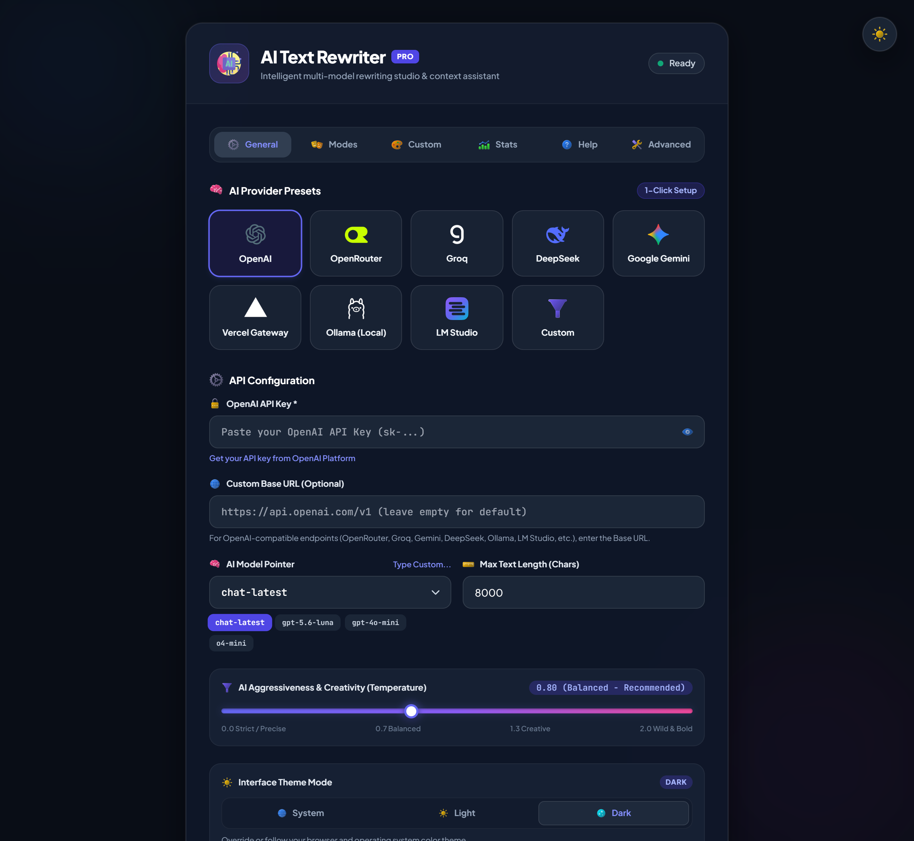
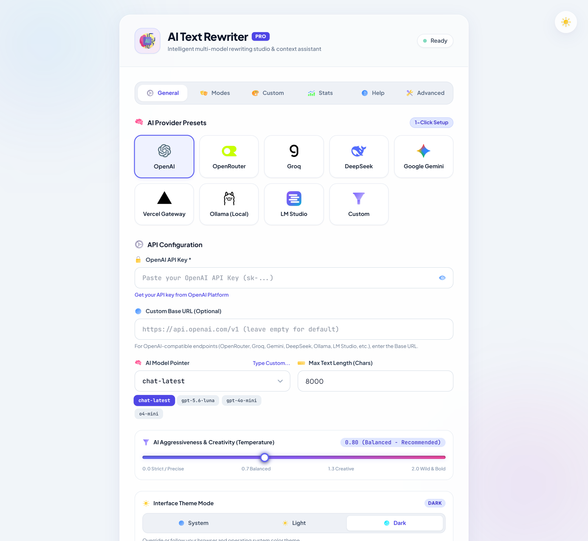
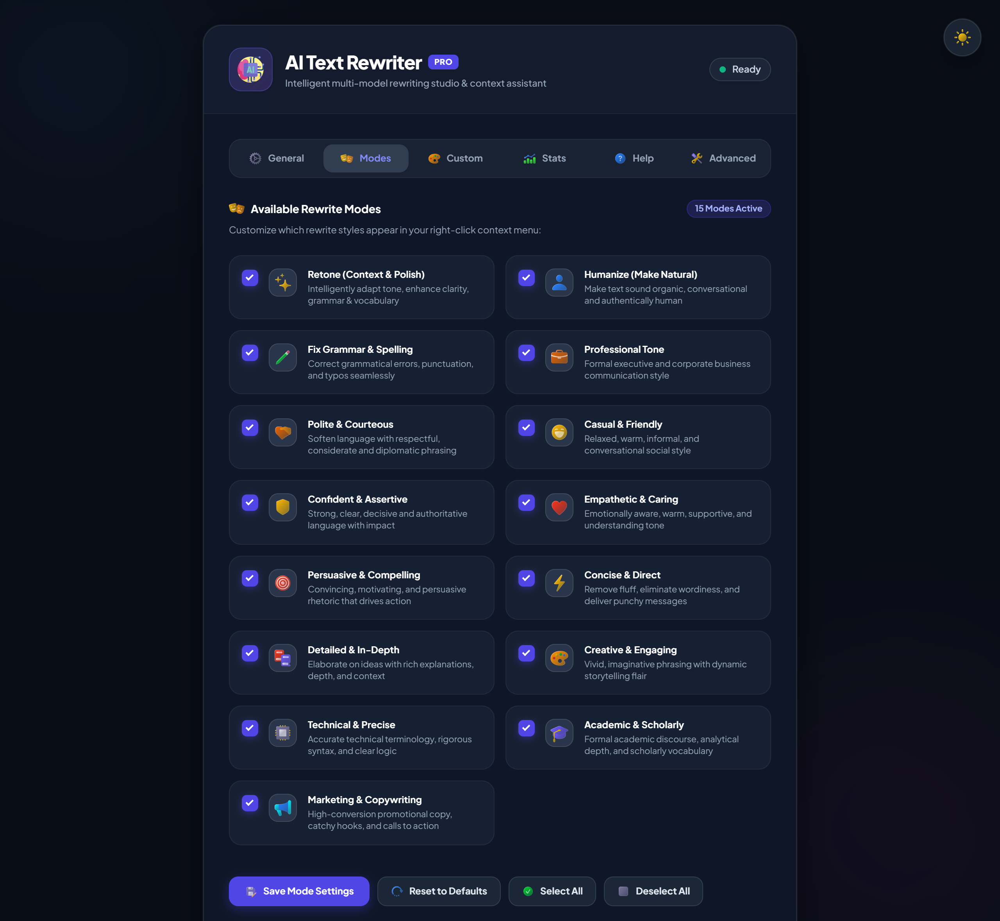
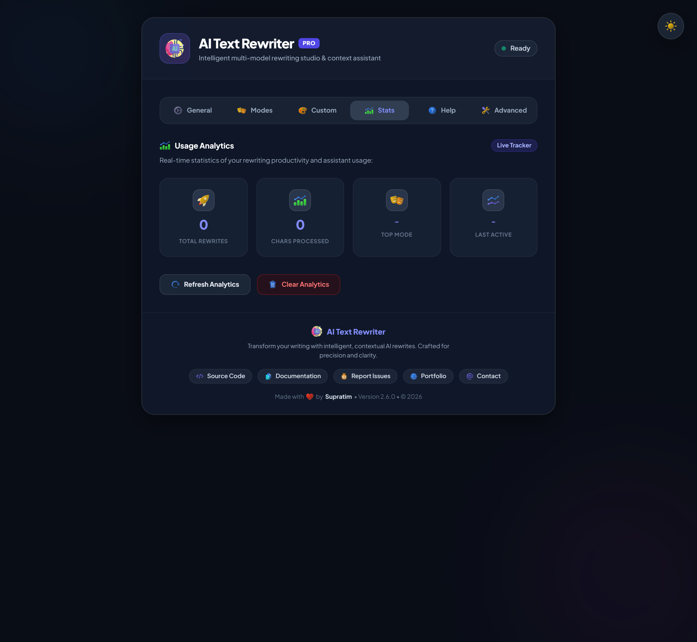

    

# ✨ AI Text Rewriter Pro - Advanced Chrome Extension for AI-Powered Writing ✨

**(Transform your writing across the web with OpenAI and OpenAI-compatible APIs! 🚀)**

        

## 📸 Visual Showcase

  <table>
    <tr>
      <td width="50%">
        <h4 align="center">🌙 Dark Theme Studio</h4>
        
      </td>
      <td width="50%">
        <h4 align="center">☀️ Light Theme Studio</h4>
        
      </td>
    </tr>
    <tr>
      <td width="50%">
        <h4 align="center">🎭 15 Writing Modes</h4>
        
      </td>
      <td width="50%">
        <h4 align="center">📊 Analytics & Usage Stats</h4>
        
      </td>
    </tr>
  </table>

**AI Text Rewriter Pro** is a modern Chrome extension that seamlessly integrates AI rewriting into any webpage, textbox, and rich-text editor. Featuring **15 built-in modes including Retone**, an **in-textbox quick AI bubble**, **in-place preview toolbar**, **customizable aggressiveness slider (0.0 to 2.0)**, and compatibility with **WhatsApp Web, Reddit, ChatGPT, and Notion**.

## 🎯 Quick Start Guide

1. **Install**: [Download from Chrome Web Store](https://chrome.google.com/webstore) or load unpacked
2. **Setup**: Add your OpenAI API key or connect to any OpenAI-compatible provider (Gemini, Groq, OpenRouter, DeepSeek, Ollama, LM Studio)
3. **Use**: Click the in-textbox AI bubble or select text → Right-click → Choose your AI rewrite mode
4. **Enjoy**: Watch your writing elevate with clean, high-precision AI assistance!

---

## 🚀 What's New in Version 3.0.0! 🚀

- 🫧 **In-Textbox Quick AI Bubble** - Compact circular brand bubble inside textboxes and chat inputs for 1-click rewrites
- 🎛️ **AI Aggressiveness & Temperature Slider** - Custom gradient slider from `0.0` (Strict & Precise) to `2.0` (Wild & Creative) with real-time feedback
- 🛡️ **In-Place Floating Confirmation Toolbar** - Dynamic mode badge with official brand icon, green `Accept [Enter]`, and frosted `Decline [Esc]`
- 🌐 **Universal Rich-Text Compatibility** - Full support for WhatsApp Web, Reddit (ProseMirror), Lexical, Notion, ChatGPT, and contentEditable fields
- 🎯 **Configurable Default Rewrite Mode** - Choose your favorite mode (Retone, Humanize, Professional, Grammar, or Custom) as the primary 1-click action
- 🎨 **Modernized Iconography & Studio UI** - High-contrast color icons for all 15 modes, tabs, and action controls
- 🌓 **Zero-Flicker Theme Override** - 3-way switcher (System, Light, Dark) with instant synchronous persistence
- 🤖 **Multi-Provider LLM Presets** - 1-click configuration for OpenAI, OpenRouter, Groq, Google Gemini, DeepSeek, Vercel, Ollama, and LM Studio
- ↶ **Atomic Undo & History** - Safely revert any changes with keyboard shortcuts (`Ctrl+Shift+Z`) or toolbar dismissal
- 📊 **Usage & Token Analytics** - Track words rewritten, tokens saved, and most-used modes

---

## 🚀 Features 🚀

*   **🫧 1-Click In-Textbox Quick Bubble:** Hover and click the brand bubble in active textboxes and chat prompts for instant rewriting!
*   **🪄 Right-Click Context Menu:** Select text anywhere on the web and pick from 15 curated writing modes
*   **🎛️ Dynamic Aggressiveness Control:** Adjust AI temperature from 0.0 to 2.0 with dynamic per-mode calibration
*   **🎭 15 Built-in Writing Modes:** Retone, Humanize, Professional, Academic, Technical, Casual, Confident, Empathetic, and more
*   **🎨 Custom Mode Studio:** Create and save your own rewrite prompts with custom instructions
*   **🛡️ In-Place Preview & Safe Revert:** Review changes inline and accept or decline with Enter / Esc
*   **🌐 WhatsApp Web & Reddit Compatible:** Seamless multi-phase DOM dispatch for modern web apps
*   **⌨️ Customizable Keyboard Shortcuts:** Fast hotkeys for Retone (`Ctrl+Shift+R`), Humanize (`Ctrl+Shift+H`), Professional (`Ctrl+Shift+P`), and Grammar (`Ctrl+Shift+G`)
*   **🧠 Universal LLM Support:** Compatible with OpenAI, Google Gemini, Groq, DeepSeek, OpenRouter, Ollama, and LM Studio
*   **🔑 Secure Local Storage:** API keys are stored securely in `chrome.storage.sync` with zero third-party telemetry

---

## 🎭 15 Built-in Writing Modes

| Mode | Purpose | Perfect For |
|------|---------|-------------|
| ✨ **Retone** | Context-aware tone, clarity, vocabulary & grammar polish | General refinement, elevating draft quality |
| 🧑 **Humanize** | Make text sound natural and conversational | Robot-like content, stiff writing |
| ✏️ **Grammar Fix** | Correct spelling and grammar errors only | Quick proofreading, error correction |
| 💼 **Professional** | Business-appropriate formal tone | Emails, reports, official documents |
| 🙏 **Polite** | Courteous and respectful language | Customer service, delicate situations |
| 😊 **Casual** | Friendly, informal conversation | Social media, casual emails |
| 💪 **Confident** | Assertive and decisive language | Presentations, negotiations |
| ❤️ **Empathetic** | Understanding and caring tone | Support messages, sensitive topics |
| 🎯 **Persuasive** | Compelling and convincing | Sales copy, proposals, arguments |
| ⚡ **Concise** | Clear and to-the-point | Headlines, summaries, tweets |
| 📚 **Detailed** | Comprehensive and thorough | Explanations, tutorials, guides |
| 🎨 **Creative** | Engaging and imaginative | Marketing copy, storytelling |
| ⚙️ **Technical** | Precise and specification-focused | Documentation, technical instructions |
| 🎓 **Academic** | Scholarly and structured formal style | Academic papers, essays, reports |
| 📢 **Marketing** | Promotional and engaging sales copy | Product launches, ads, landing pages |

---

## 🛠️ Installation & Quick Start Guide 🛠️

### 📦 Installation (Let's Get This Party Started!)

Alright, since this isn't (yet?) on the Chrome Web Store (because who has time for reviews? 🙄), you gotta load it manually like a true tech wizard (or someone who can follow instructions).

1.  **Grab the Goods 🛍️:** Download the extension files. Either clone the repository or download the ZIP and unzip it somewhere you won't accidentally delete it later. Let's call this magical place the `ai-rewriter-extension` folder.
2.  **Open Chrome's Secret Lair 🚪:** Open Google Chrome, type `chrome://extensions` in your address bar, and hit Enter. Spooooky!
3.  **Flip the Super Secret Developer Switch 🕵️‍♀️:** Look for a toggle labeled "Developer mode" (usually in the top right corner). Click it. If it's on, you're basically a hacker now. Congrats.
4.  **Shove the Folder at Chrome 🚀:** Click the "Load unpacked" button that magically appeared. A file browser window will pop up.
5.  **Point and Shoot 👉:** Navigate to and select that `ai-rewriter-extension` folder (the one *containing* the `manifest.json` file, not the zip file!). Click "Select Folder" or "Open".
6.  **Bask in the Glory (or fix errors) 🙏:** If all went well, you should see the "AI Text Rewriter Pro" extension card appear on the page! If you see angry red errors, you probably messed up step 5. Go back and try again, champ. 💪
7.  **Pin for Easy Access:** Click the puzzle piece icon in Chrome's toolbar and pin the AI Text Rewriter Pro extension for quick access.

🎉 **Ta-da!** The extension icon should appear in your Chrome toolbar!

### 🚀 Quick Start Guide

#### 1. Initial Setup
1. Click the extension icon or right-click → "Settings"
2. Get your API key from [OpenAI Platform](https://platform.openai.com/api-keys)
3. (Optional) Add custom base URL for OpenAI-compatible APIs
4. Paste your API key and test the connection
5. Customize your settings (models, modes, shortcuts)
6. Save and start rewriting!

#### 2. Using the Extension
**Right-Click Method:**
1. Select text in any editable field
2. Right-click on the selected text
3. Choose "✨ Rewrite with AI" → pick your desired mode
4. Watch the magic happen!

**Keyboard Shortcuts:**
- `Ctrl+Shift+R` - Retone selected text (Context, Clarity & Tone)
- `Ctrl+Shift+H` - Humanize selected text
- `Ctrl+Shift+P` - Professional tone
- `Ctrl+Shift+G` - Fix grammar and spelling
- `Undo Rewrite` - Configurable in `chrome://extensions/shortcuts` (e.g., `Ctrl+Shift+Z`)

---

## ⚙️ Configuration: The Golden Ticket 🔑

Okay, here's the *slightly* annoying part. This extension needs **YOUR** OpenAI API Key to actually talk to the AI. Think of it like needing a password to get into the cool AI club.

**Why?** Because accessing powerful AI models costs money (or at least has usage limits), and OpenAI needs to know who's asking! This extension makes requests directly from *your* browser using *your* key.

**Where to Snag This Magical Key? 🤔**

1.  Go to the **[OpenAI Platform](https://platform.openai.com/api-keys)**. You'll need an OpenAI account.
2.  Click "Create new secret key" or "+Create new secret key".
3.  Give your key a name (like "AI Rewriter Extension").
4.  **COPY THIS KEY!** 📋 It starts with `sk-` and is a long string of random characters. Treat it like a password. Don't share it publicly!
5.  **Important:** You won't be able to see this key again, so save it somewhere safe!

### 🚀 AI Provider Presets

The extension includes built-in 1-click presets for curated cloud and local providers with dynamic latest-version aliases, plus full custom endpoint support:

| Provider | Icon | Endpoint / Base URL | Default Model | Key Format |
|---|---|---|---|---|
| **OpenAI** | 🟢 | `https://api.openai.com/v1` | `chat-latest` (Dynamic latest pointer) | `sk-...` |
| **OpenRouter** | 🔀 | `https://openrouter.ai/api/v1` | `openrouter/auto` (Smart Auto-Router) | `sk-or-v1-...` |
| **Groq** | ⚡ | `https://api.groq.com/openai/v1` | `llama-3.3-70b-versatile` | `gsk_...` |
| **DeepSeek** | 🐋 | `https://api.deepseek.com` | `deepseek-v4-flash` | `sk-...` |
| **Google Gemini** | ✨ | `https://generativelanguage.googleapis.com/v1beta/openai/` | `gemini-flash-lite-latest` | `AIzaSy...` |
| **Vercel AI Gateway** | ▲ | `https://ai-gateway.vercel.sh/v1` | `openai/chat-latest` | API key |
| **Ollama (Local)** | 🦙 | `http://localhost:11434/v1` | `llama3.2` | Free / None |
| **LM Studio (Local)** | 🧪 | `http://localhost:1234/v1` | `local-model` (Loaded model) | Free / None |
| **Custom** | ⚙️ | *User-defined* | *User-defined* | Any compatible key |

**Plugging in the Power Cord 🔌**

1. Click the **AI Text Rewriter Pro extension icon** 🧩 or go to Extension Options.
2. In the **AI Provider Presets** section, click on your provider card (e.g. OpenAI, Groq, Gemini, OpenRouter, DeepSeek, Ollama, or Custom).
3. Paste your API key (if using cloud providers) or connect directly to local Ollama / LM Studio.
4. Click "**Test API Key**" 🧪 → Click "**Save Settings**" 💾.
5. You should see a green success message confirming your connection!

**❗ IMPORTANT NOTE ABOUT YOUR KEY ❗**

*   **Keep it Secret, Keep it Safe!** 🔒 Don't commit it to public code, don't paste it in random chat rooms. It's linked to *your* OpenAI account.
*   **Usage Costs $$$!** OpenAI charges for API usage based on tokens. Check their [pricing page](https://openai.com/api/pricing/)! You are responsible for the usage associated with your key. Start with GPT-4o-mini for cost-effective rewrites. Don't blame us if you rewrite War and Peace and get a bill. 💸
*   **Free Alternative:** Use local models with LM Studio or Ollama for completely free, private AI rewriting!

---

## ✨ How to Use (The Fun Part!) ✨

Okay, installed? ✅ API key saved? ✅ Ready to rock? ✅ Let's rewrite!

1.  **Find a Victim... I Mean, a Text Box 🎯:** Go to any website with a text input field (`<textarea>`, some `<input>` fields). Think email drafts, comment boxes, social media posts, online notepads... you get the idea.
    *   **Heads Up:** This probably *won't* work on super fancy custom editors like Google Docs or Notion directly, as they do weird things. It *definitely* won't work on `chrome://` pages (like the extensions page itself) for security reasons! Stick to normal web pages (http/https).
2.  **Type Your Soon-to-be-Glorious Words ⌨️:** Write something. Anything! Pour your heart out, or just type "the quick brown fox jumps over the lazy dog".
3.  **Highlight the Chosen Ones ✨:** Select the text you want to transform using your mouse or keyboard.
4.  **Invoke the Menu! Right-Click Pow! 🖱️💥:** Right-click directly *on the selected text*.
5.  **Behold! The Menu! 🤩:** Hover over the "**✨ Rewrite with AI**" option in the context menu that pops up.
6.  **Pick Your Mode 🎭:** Choose one of the 15 available modes from the sub-menu (Retone, Humanize, Professional, Creative, Technical, etc.).
7.  **Patience, Grasshopper... 🌱:** A sleek notification will appear showing the progress. The extension sends your text and chosen mode to the selected AI model. Response time depends on text complexity and your selected AI model. 🐹
8.  **Witness the Transformation! 🪄:** If the AI gods smile upon you, the selected text will be **replaced** with the rewritten version! 🎉

---

## ⚙️ Advanced Features

### 🎨 Custom Modes
Create your own rewriting styles:
1. Open Extension Options → Custom Modes
2. Enter a mode name and prompt instructions
3. Save and use it like any built-in mode
4. Export/import custom modes between devices

### 📊 Usage Analytics
Track your writing productivity:
- Total rewrites performed
- Characters processed
- Most-used modes
- Daily usage trends

### 🛡️ Safety & Quality
- **Content Preservation**: Maintains original meaning and context
- **Smart Retries**: Automatic exponential backoff for failed requests
- **Length Validation**: Configurable limits to manage costs
- **Input Sanitization**: Cleans whitespace and unwanted formatting

---

## 👥 Perfect For

- **Content Creators** - Blog posts, social media, video scripts
- **Professionals** - Business emails, reports, documentation
- **Students & Academics** - Essays, research papers, study notes
- **Non-Native Speakers** - Natural phrasing and grammar correction
- **Customer Support** - Polite, empathetic, and clear replies
- **Marketers** - Create compelling copy
- **Technical Writers** - Clarify complex concepts

---

## 🎭 Detailed Mode Guide (Choose Your Weapon Wisely) 🎭

### Core & Context Enhancement Modes

*   **✨ `Retone`:** Context-aware refinement & polish 🪄
    *   *Perfect for:* Intelligently understanding the context of the writing and rewriting it with elevated tone, crystalline clarity, superior vocabulary, and flawless grammar.

*   **🧑 `Humanize`:** Make text sound natural and conversational 🤖➡️🧑‍🎨
    *   *Perfect for:* Robot-like content, stiff writing, overly formal text that needs a conversational flow.

*   **✏️ `Grammar Fix`:** Your personal proofreader 🧐
    *   *Perfect for:* Quick error correction without changing tone or meaning. Focuses purely on spelling and grammar.

*   **💼 `Professional`:** Business-appropriate formal tone 👔
    *   *Perfect for:* Work emails, reports, official documents, presentations, and corporate communication.

*   **🙏 `Polite`:** Courteous and respectful language 🤝
    *   *Perfect for:* Customer service, delicate situations, requests, and when you need to sound diplomatic.

### Personality & Tone Modes

*   **😊 `Casual`:** Friendly, informal conversation ☕
    *   *Perfect for:* Social media posts, casual emails, friendly messages, and relaxed communication.

*   **💪 `Confident`:** Assertive and decisive language 🚀
    *   *Perfect for:* Presentations, negotiations, leadership communication, and when you need to sound authoritative.

*   **❤️ `Empathetic`:** Understanding and caring tone 🫂
    *   *Perfect for:* Support messages, sensitive topics, consoling someone, and emotional communication.

### Content Optimization Modes

*   **🎯 `Persuasive`:** Compelling and convincing language 🎯
    *   *Perfect for:* Sales copy, proposals, arguments, marketing content, and calls-to-action.

*   **⚡ `Concise`:** Clear and to-the-point ⚡
    *   *Perfect for:* Headlines, summaries, tweets, bullet points, and when brevity matters.

*   **📚 `Detailed`:** Comprehensive and thorough 📖
    *   *Perfect for:* Explanations, tutorials, guides, documentation, and in-depth content.

*   **🎨 `Creative`:** Engaging and imaginative 🎨
    *   *Perfect for:* Marketing copy, storytelling, creative writing, and content that needs flair.

### Specialized Modes

*   **⚙️ `Technical`:** Precise and specification-focused 🔬
    *   *Perfect for:* Documentation, instructions, technical writing, and professional specifications.

*   **🎓 `Academic`:** Scholarly and structured formal style 🏛️
    *   *Perfect for:* Academic papers, essays, literature reviews, and research summaries.

*   **📢 `Marketing`:** High-conversion promotional copy 📣
    *   *Perfect for:* Product promotions, ad copy, value propositions, and landing pages.

---

## 🤔 Troubleshooting (When Things Go Sideways) 🤔

Yeah, sometimes technology just says "NOPE". 🙅‍♂️ Here's a comprehensive guide:

### Common Issues

**😭 It's Not Working AT ALL!**
*   **API Key:** Did you *actually* save your API key correctly in the options? Is it the *right* key? Double-check!
*   **Reload Extension:** Go to `chrome://extensions` and click the little refresh icon 🔄 on the AI Text Rewriter Pro card. Sometimes extensions get sleepy.
*   **Reload Page:** Try refreshing the webpage (F5) you're trying to use it on.
*   **Check Console (Background):** Go to `chrome://extensions`, find the AI Text Rewriter Pro card, and click the "**Service worker**" link. Look for **RED ERROR MESSAGES** in the console window that pops up *after* you try to use the extension. Copy/paste these if you need help!
*   **Check Console (Page):** On the webpage where it's failing, right-click anywhere, select "Inspect", and go to the "Console" tab. Try using the extension again. Any **RED ERRORS** there?

**"API Key not working"**
- Verify key is correctly copied from the AI provider
- Check if your account has API access enabled
- Test connection in Settings → General → Test API Key

**🚫 Error: `Cannot access chrome:// URL`**
*   You're trying to use the extension on a Chrome settings page (like `chrome://extensions`). For security reasons, Chrome blocks extensions from messing with these pages. Use it on a regular `http://` or `https://` website.

**"Cannot rewrite on this page"**
- Extension only works on regular websites (http/https)
- Won't work on Chrome internal pages (chrome://)
- Ensure you're in an editable text field

**"Text not replacing"**
- Click in the text field before selecting text
- Try refreshing the page and attempting again
- Check browser console for detailed error messages

**✨ Weird Output (Options, Asterisks `*`, Emails when you didn't ask?)**
*   The AI can be a bit... creative. We've tried to tell it *very sternly* in the prompts to JUST give the rewritten text and nothing else (no markdown like `*emphasis*`, no "Option 1:", etc.).
*   If you still get weird formatting or unexpected content (like a full email for "Professional Tone"), the AI might be ignoring instructions. We added some cleanup code, but it's not perfect. Prompt engineering is hard! 🤷‍♂️

**🚦 Error: `Content blocked by API...`**
*   The AI's safety filters might have flagged your original text or the requested rewrite. Try rephrasing your original text or using a different mode.

**"Too many requests"**
- Built-in rate limiting prevents API overuse
- Wait 60 seconds and try again
- Consider upgrading your plan for higher limits

**📉 API Errors (4xx/5xx Status)**
*   `400 Bad Request`: Often means the model name is wrong or the request format is broken. Try switching AI models in settings.
*   `401 Unauthorized` / `403 Forbidden`: Almost always an **API Key problem**. Is it correct? Is it enabled? Does your project have the API enabled?
*   `404 Not Found`: The API endpoint URL might be wrong.
*   `429 Too Many Requests`: You might be hitting rate limits. Slow down!
*   `500 Internal Server Error`: The servers are having a hiccup. Try again later. ☕

### Getting Help
1. Check the browser console (F12) for detailed error messages
2. Test your API connection in the settings
3. Try different AI models if one isn't working
4. Report issues with specific error messages

---

## 🔐 Privacy & Security

- **Your API Key**: Stored locally in your browser, never shared
- **Your Text**: Sent directly to the AI provider's servers, not stored by us
- **Usage Data**: Optional analytics stored locally only
- **No External Tracking**: No third-party analytics or tracking
- **Open Source**: Inspect the code to verify privacy practices

---

## 📈 Performance Tips

1. **Choose the Right Model**:
   - Gemini 1.5 Flash: Fastest, most cost-effective
   - Gemini 1.5 Pro: More capable, better for complex tasks
   - Gemini 2.0 Flash: Latest features, experimental

2. **Optimize Text Length**:
   - Keep selections under 2000 characters for best speed
   - Break long documents into smaller sections
   - Use concise mode for lengthy content

3. **Use Custom Modes**:
   - Create specific prompts for recurring tasks
   - More targeted results than generic modes
   - Save time with personalized workflows

---

## 🔮 Future Roadmap

- 🌐 **Multi-language Support** - Rewrite in different languages
- 🔊 **Voice Input** - Dictate text for rewriting
- 📱 **Mobile Support** - Browser extension for mobile
- 🤖 **AI Model Comparison** - Side-by-side results
- 📝 **Template Library** - Pre-made prompts for common tasks
- 🔗 **Integration APIs** - Connect with other writing tools
- 📊 **Advanced Analytics** - Writing improvement insights

---

## 💡 Contributing (Got Ideas? Found Bugs?) 💡🐛

Hey, if you have ideas to make this less buggy or more awesome, or if you found a hilarious bug (like it rewriting everything into pirate speak 🏴‍☠️ - which would be kinda cool, actually), feel free to:

*   Open an issue on the GitHub repository (if this *is* on GitHub... otherwise, uh... tell the developer?).
*   Fork it, fix it, and submit a pull request (again, GitHub stuff).

We appreciate the help making this thing slightly less likely to explode. 🔥

---

## 📜 License (The Legal Mumbo Jumbo) 📜

This extension is licensed under the **MIT License**.

Basically, this means you can do almost whatever you want with this code (use it, copy it, modify it, sell it - though good luck with that!), as long as you include the original copyright and license notice.

**BUT, there's NO WARRANTY.** If this extension accidentally deletes your masterpiece novel, formats your hard drive, or makes your coffee cold... tough luck. Use at your own risk! 😉

---

## 📝 Acknowledgments & Credits

- **Google Gemini AI** - Powering the intelligence behind every rewrite
- **Chrome Extension APIs** - Making seamless integration possible
- **Open Source Community** - Inspiration and best practices
- **Beta Testers** - Feedback that shaped this extension
- Special thanks to the Gemini, OpenAI and Anthropic team for their amazing AI technology!
- Thanks to the Chrome extension development community for all the resources and inspiration! 🙌
- And a big shoutout to you, the user! Thanks for trying out this extension and making the internet a slightly more interesting place! 🌍✨

---

## 💝 Support the Project

Enjoying AI Text Rewriter Pro? Here's how you can help:

1. ⭐ **Star the repository** (if open source)
2. 💬 **Share with friends** who write content
3. 🐛 **Report bugs** to help improve the extension
4. 💡 **Suggest features** for future versions
5. ☕ **Buy me a chai** (because coffee is overrated!)

--- 
If you like this extension, consider buying me a coffee! ☕ (Just kidding, I don't drink coffee. But I appreciate the thought!)

**Transform your writing today with AI Text Rewriter Pro!** ✨

*Made with 💙 and lots of ☕ (actually 🫖 chai) by Supratim*

**Happy Rewriting! May your words be ever in your favor!** ✨
